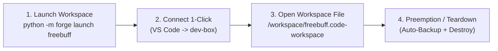

# 📘 Runbook: Ephemeral Zero-Trust Spot Dev Box (Self-Healing Regional MIG)

A self-contained guide to spin up, connect, work on, and tear down an ultra-resilient, ultra-low-cost (**~$0.47/day**) development environment on Google Cloud.

Powered by a **Regional Managed Instance Group (MIG)** that provides:
1. **1-Command Multi-Repo Workspace Launching**: Run `python -m forge launch <workspace>` to automatically resolve all member repositories, clone them into `/workspace/`, and generate a remote `.code-workspace` file.
2. **Hands-Free Multi-Zone Hopping**: If Spot capacity vanishes in one zone, Google automatically spawns a replacement in another zone in the region.
3. **Zero-Trust IAP Tunneling**: Zero public open ports; tunnels securely through Google Cloud Identity-Aware Proxy (IAP).
4. **Universal Preemption Safety Net**: Automatically commits and pushes uncommitted code to GitHub before the VM dies.

---

## ⚡ Quick Daily Workflow (TL;DR)



> [!TIP]
> ### 💡 Pro-Tip: Shop Around US Regions via Capacity Advisor First
> While standard CPU Spot pricing is roughly uniform, **GPU Spot discounts vary dramatically** (e.g. **51% off in `us-east4`** vs. **40% in `us-west1` / `us-central1`**).
> 
> **Rule of Thumb:** Prioritize **High Obtainability (`0.7–1.0`)** and **Estimated Uptime (`3600s+`)** over raw discount percentage. An extra 10% discount is useless if the machine gets preempted every 15 minutes!
> 
> Check real-time capacity and obtainability in PowerShell before picking a region:
> ```powershell
> gcloud beta compute advice capacity `
>     --provisioning-model=SPOT `
>     --instance-selection-machine-types=g2-standard-4 `
>     --target-distribution-shape=ANY `
>     --size=1 `
>     --region=us-east4
> ```

---

> [!IMPORTANT]
> ### ⚠️ Mandatory Prerequisites Before Your Very First Launch!
> Before running Step 1 for the very first time on your workstation, ensure you have completed:
> 1. **[Appendix B: GCP Secret Manager Setup](#-appendix-b-one-time-gcp-secret-manager-setup)**: Stores your GitHub token in Secret Manager so VMs can clone and push to your private repositories.
> 2. **[Appendix A: SSH Config & IAP Proxy Helper](#-appendix-a-one-time-ssh-config--iap-helper-for-vs-code)**: Places `C:\Users\mohds\.ssh\iap_proxy.ps1` and updates `~/.ssh/config` so VS Code can connect with 1-click via Google IAP.

---

## 🚀 Step 1: Launch Your Workspace

Launch any multi-repo workspace from `C:\Users\mohds\Documents\GitHub\_workspaces` (e.g. `freebuff`, `openvino`, `blog`, `vouch`) with one command:

```powershell
python -m forge launch freebuff
```

### ⚙️ Supported CLI Options & Flags

`forge launch` supports custom machine sizes, regions, and workspace paths:

```text
usage: forge launch [-h] [--region REGION] [--machine-type MACHINE_TYPE] workspace
```

| Argument / Flag | Default | Description | Example |
| :--- | :--- | :--- | :--- |
| `workspace` *(positional)* | *(required)* | Name of the `.code-workspace` file in `_workspaces/`, or an absolute path to any `.code-workspace` file. | `freebuff` or `C:\path\to\my.code-workspace` |
| `--machine-type` | `e2-highmem-2` | GCP Compute Engine machine type (CPU, RAM, or GPU-ready shape). | `--machine-type e2-standard-4` or `--machine-type c2-standard-8` |
| `--region` | `us-west1` | Target GCP region for the Regional Managed Instance Group. | `--region us-east4` or `--region us-central1` |

#### Common Launch Examples:
```powershell
# Standard freebuff launch (e2-highmem-2 in us-west1)
python -m forge launch freebuff

# Beefier CPU for heavy compilation (8 vCPUs / 32GB RAM in us-central1)
python -m forge launch freebuff --machine-type c2-standard-8 --region us-central1

# Custom workspace file outside default folder
python -m forge launch "C:\Users\mohds\Documents\GitHub\custom.code-workspace"
```

### What happens automatically under the hood:
1. **Local Resolver**: Reads the workspace file, finds the member repositories in `C:\Users\mohds\Documents\GitHub`, queries each member repository's Git `origin` URL, and bundles them into an ephemeral JSON manifest.
2. **Cloud Deployment**: Builds a versioned GCP instance template embedding the manifest, startup script, and shutdown hook, then updates/creates the Regional Managed Instance Group (`dev-box-mig`).
3. **VM Boot Execution (`bootstrap.py`)**:
   - Installs Node.js LTS, npm, `freebuff`, and `gh`.
   - Reads the workspace manifest from instance metadata.
   - Automatically clones all member repositories under `/workspace/`.
   - Generates `/workspace/<name>.code-workspace` with Linux-compatible relative paths.
   - Sets user ownership to `mohds` and configures Git safe directories.

---

## 💻 Step 2: Connect via VS Code (1-Click)

You **never** need to run background tunnels or look up random instance names and zones.

1. Open **VS Code**.
2. Press `Ctrl + Shift + P` -> Select **`Remote-SSH: Connect to Host...`**.
3. Select **`dev-box`**.
4. Click **File > Open Workspace from File...** -> Select **`/workspace/freebuff.code-workspace`**.
5. **All repositories in the workspace appear in your VS Code sidebar instantly!**

### What is pre-configured and ready:
- **`freebuff`**: Installed globally (`/usr/bin/freebuff`).
- **`gh`**: Automatically authenticated as `hsm207` in both login and interactive VS Code terminals.
- **`git`**: Configured with `safe.directory '*'`.

---

## 🛡️ Self-Healing & The Universal Preemption Safety Net

### What happens if Google preempts your Spot VM?
1. **The 30-second ACPI shutdown hook triggers automatically (`backup.py`):**
   - Scans `/workspace/*` and `/home/mohds/*` for any `.git` repository.
   - If uncommitted edits or untracked files exist, it automatically creates a branch:
     ```text
     spot-backup-YYYYMMDD-HHMMSS
     ```
     and pushes it directly to that repository's GitHub remote before termination.
2. **Automatic Multi-Zone Hopping:**
   - The Regional MIG detects that the instance stopped.
   - If capacity is exhausted in the current zone (e.g. `us-west1-a`), the MIG automatically spawns a replacement instance in another zone (e.g. `us-west1-b` or `us-west1-c`).
   - The replacement instance runs `bootstrap.py` and re-clones your repos and workspace.
3. **Seamless Reconnection:**
   - Simply click **`dev-box`** in VS Code again.
   - The dynamic proxy helper automatically detects the new instance name and new zone and connects immediately.

---

---

## 🍴 Git Remote Standard Convention (Forks & Upstreams)

To ensure the automated preemption backup hook always has write permissions to push uncommitted work, all local repositories adopt the official **GitHub CLI (`gh repo fork --clone`) standard convention**:

| Remote | URL Target | Purpose | Permissions |
| :--- | :--- | :--- | :--- |
| **`origin`** | `https://github.com/hsm207/<repo>.git` | Your personal fork | **Read / Write** (Pushes go here) |
| **`upstream`** | `https://github.com/<org>/<repo>.git` | Canonical upstream repository | **Read-Only** (Syncing updates) |

### Verifying or Standardizing a Repository
If a repository was cloned directly from upstream and has a separate personal fork:
```powershell
# Rename upstream to upstream remote
git remote rename origin upstream

# Add your personal fork as origin
git remote add origin https://github.com/hsm207/<repo>.git

# Set local main to track origin/main
git fetch origin
git branch -u origin/main main
```
`forge` automatically queries `origin` so any spawned Cloud VM will always clone your writable fork.

---

## 🔥 Step 3: End of Day — Teardown

When you are done for the day, tear down the group to stop billing immediately:

```powershell
# Delete the Managed Instance Group (shuts down and deletes running VMs)
gcloud compute instance-groups managed delete dev-box-mig --region=us-west1 --project=compute-cluster-492317 --quiet
```

### 🔄 How to Recover Preemption Backups
If the VM was preempted while you had uncommitted edits, the preemption hook automatically pushed branches in this format:
```text
spot-backup-YYYYMMDD-HHMMSS
```
To inspect or cherry-pick/merge the changes into your local branch:
```powershell
git fetch origin
git log origin/spot-backup-YYYYMMDD-HHMMSS -n 1 --stat
git merge origin/spot-backup-YYYYMMDD-HHMMSS
```
Once merged or verified, delete the backup branch:
```powershell
git push origin --delete spot-backup-YYYYMMDD-HHMMSS
```

---

## 📖 Appendix A: One-Time SSH Config & IAP Helper for VS Code

To make VS Code show a permanent **`dev-box`** option and dynamically resolve whichever instance and zone is currently active, set up these two files once:

### 1. The Helper Script (`C:\Users\mohds\.ssh\iap_proxy.ps1`)
```powershell
param(
    [string]$HostName,
    [string]$Port,
    [string]$Project = "compute-cluster-492317"
)

# If HostName is dev-box or dev-box-*, resolve the active instance name and zone dynamically
if ($HostName -eq "dev-box" -or $HostName -like "dev-box-*") {
    $info = (gcloud compute instances list --filter="name ~ dev-box" --format="csv[no-heading](name,zone)" --project=$Project)
    if ($info) {
        $first = ($info -split "`r?`n")[0]
        $parts = $first -split ","
        $actualName = $parts[0].Trim()
        $zone = $parts[1].Trim()
    } else {
        Write-Error "No active dev-box instances found in project $Project"
        exit 1
    }
} else {
    $actualName = $HostName
    $zone = (gcloud compute instances list --filter="name=$actualName" --format="value(zone)" --project=$Project).Trim()
}

& gcloud.cmd compute start-iap-tunnel $actualName $Port --listen-on-stdin --project=$Project --zone=$zone
```

### 2. Configuration (`C:\Users\mohds\.ssh\config`)
```ssh-config
Host dev-box dev-box-*
    ProxyCommand powershell.exe -ExecutionPolicy Bypass -File "C:\Users\mohds\.ssh\iap_proxy.ps1" -HostName %h -Port %p
    User mohds
    IdentityFile C:/Users/mohds/.ssh/google_compute_engine
    RequestTTY force
    StrictHostKeyChecking no
    UserKnownHostsFile /dev/null
```

---

## 📖 Appendix B: One-Time GCP Secret Manager Setup

If setting up a new GCP project or refreshing credentials:

1. **Push your active GitHub token:**
   ```powershell
   $token = (gh auth token).Trim()
   $token | gcloud secrets create github-token `
       --data-file=- `
       --project=compute-cluster-492317 `
       --replication-policy="automatic" `
       --labels="project=dev-spot-box,environment=dev"
   ```

2. **Grant Secret Access to the Compute Service Account:**
   ```powershell
   gcloud secrets add-iam-policy-binding github-token `
       --member="serviceAccount:370829488505-compute@developer.gserviceaccount.com" `
       --role="roles/secretmanager.secretAccessor" `
       --project=compute-cluster-492317
   ```

---

## 📖 Appendix C: NVIDIA L4 GPU Peak Preemption Windows & Timezone Strategy

Spot VM pricing and preemption rates are dynamic, updated by Google Cloud **at most once every 24 hours at midnight Pacific Time (00:00 PT / 09:00 CEST)**. Check availability once before your work session.

> **Last Checked:** September 17, 2026, 22:30 CEST (Berlin Time)

### 🌍 Peak vs. Off-Peak Windows (US Regions -> Berlin Time / CEST)

| Window | UTC Time | US Local Time | Berlin Time (CEST / UTC+2) | Recommendation |
| :--- | :---: | :---: | :---: | :--- |
| **🟢 The "Sweet Spot" (Lowest Preemption / Maximum Uptime)** | **04:00 – 12:00 UTC** | 11:00 PM – 7:00 AM EST<br>8:00 PM – 4:00 AM PST | **06:00 – 14:00 (6:00 AM – 2:00 PM)** | **BEST WORKING HOURS!** US datacenters are asleep. Surplus GPU capacity is at its daily maximum. |
| **🔴 Primary Peak Preemption Window** | **14:00 – 21:00 UTC** | 9:00 AM – 4:00 PM EST<br>6:00 AM – 1:00 PM PST | **16:00 – 23:00 (4:00 PM – 11:00 PM)** | **US Workday Peak.** Corporate real-time inference and dev workloads ramp up. Interruption risk increases. |
| **🟡 Secondary Sub-Peak (Nightly Pipelines)** | **01:00 – 04:00 UTC** | 8:00 PM – 11:00 PM EST<br>5:00 PM – 8:00 PM PST | **03:00 – 06:00 (3:00 AM – 6:00 AM)** | Overnight automated batch jobs and ETL training pipelines in US zones. |
| **🟢 Weekends (Saturday & Sunday UTC)** | All Day | All Day | All Day | **Very Stable.** Corporate GPU demand drops significantly across all US regions. |

---

## 📌 Backlog / Future Exploration
- **Pre-baked GPU Deep Learning Images**: Experiment with Google's official Deep Learning VM images (e.g. `common-cu129-ubuntu-2204-nvidia-580` from `deeplearning-platform-release`) for zero-download CUDA + Docker setups on GPU Spot instances.
